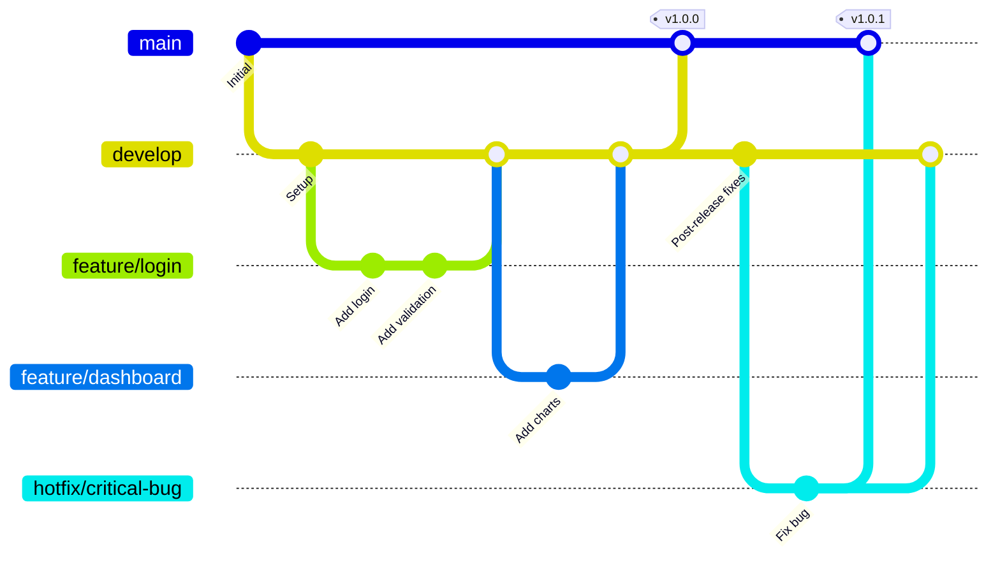

# 🔐 Guía de Mejores Prácticas: Git Local en Coolify

> **Versión**: 1.0  
> **Fecha**: 2026-01-17  
> **Audiencia**: Platform Engineering & DevSecOps

---

## 📋 Tabla de Contenidos

1. [Seguridad de Acceso](#1-seguridad-de-acceso)
2. [Protección de Ramas](#2-protección-de-ramas)
3. [Higiene de Secretos](#3-higiene-de-secretos)
4. [Estrategia de Branching](#4-estrategia-de-branching)
5. [Flujo con Coolify](#5-flujo-con-coolify)
6. [Git Hooks](#6-git-hooks)
7. [Monitoreo y Auditoría](#7-monitoreo-y-auditoría)

---

## 1. Seguridad de Acceso

### 1.1 Configuración de Llaves SSH

Las llaves SSH son el método más seguro para autenticación en Git local.

#### Generar una llave SSH Ed25519 (recomendada)

```bash
# En el cliente (tu máquina local)
ssh-keygen -t ed25519 -C "tu-email@empresa.com" -f ~/.ssh/coolify_git

# Si tu sistema no soporta Ed25519, usa RSA-4096
ssh-keygen -t rsa -b 4096 -C "tu-email@empresa.com" -f ~/.ssh/coolify_git_rsa
```

#### Configurar el agente SSH

```bash
# Iniciar el agente
eval "$(ssh-agent -s)"

# Añadir la llave
ssh-add ~/.ssh/coolify_git

# Verificar llaves cargadas
ssh-add -l
```

#### Configurar ~/.ssh/config

```ssh-config
# Servidor Git en Coolify
Host coolify-git
    HostName 192.168.1.100  # IP de tu servidor Coolify
    User git
    Port 22
    IdentityFile ~/.ssh/coolify_git
    IdentitiesOnly yes
    PreferredAuthentications publickey
    # Opciones de seguridad adicionales
    StrictHostKeyChecking yes
    UserKnownHostsFile ~/.ssh/known_hosts
```

#### En el servidor (Coolify)

```bash
# Crear directorio .ssh para el usuario git
mkdir -p /home/git/.ssh
chmod 700 /home/git/.ssh

# Añadir la clave pública autorizada
cat ~/.ssh/coolify_git.pub >> /home/git/.ssh/authorized_keys
chmod 600 /home/git/.ssh/authorized_keys
chown -R git:git /home/git/.ssh

# Deshabilitar autenticación por contraseña (editar sshd_config)
# PasswordAuthentication no
# PubkeyAuthentication yes
# PermitRootLogin no
```

### 1.2 Autenticación 2FA (Two-Factor Authentication)

> [!IMPORTANT]  
> Para servidores Git locales (como Gitea o GitLab self-hosted en Coolify), configura 2FA a nivel de aplicación.

#### Si usas Gitea en Coolify

```bash
# En el archivo app.ini de Gitea
[service]
REQUIRE_SIGNIN_VIEW = true
ENABLE_NOTIFY_MAIL = true

[security]
INSTALL_LOCK = true
SECRET_KEY = <genera-una-clave-segura-de-256-bits>
INTERNAL_TOKEN = <genera-otro-token>
DISABLE_REGISTRATION = true  # Solo admins pueden crear usuarios
REQUIRE_EXTERNAL_REGISTRATION_PASSWORD = true
```

Los usuarios pueden habilitar 2FA desde:
**Settings → Security → Two-Factor Authentication**

Aplicaciones TOTP recomendadas:
- **Authy**
- **Google Authenticator**
- **Microsoft Authenticator**

### 1.3 Políticas de Personal Access Tokens (PAT)

#### Mejores prácticas para PATs

```yaml
# Política de tokens recomendada
token_policy:
  max_lifetime_days: 90        # Expiración máxima
  require_scopes: true         # Principio de mínimo privilegio
  naming_convention: "{user}_{purpose}_{date}"
  
  scopes_by_use_case:
    ci_cd:
      - repo:read
      - repo:write
      - webhook:read
    
    deployments:
      - repo:read
      
    admin:
      - admin:full  # Solo para administradores
```

#### Script para auditar tokens expirados

```bash
#!/bin/bash
# audit_tokens.sh - Ejecutar mensualmente

echo "=== Auditoría de PATs - $(date) ==="

# Para Gitea
curl -s -H "Authorization: token $ADMIN_TOKEN" \
  "http://coolify-git:3000/api/v1/users/tokens" | \
  jq '.[] | select(.expiry < now) | {name, user, expiry}'

# Enviar alerta si hay tokens expirados
```

---

## 2. Protección de Ramas

### 2.1 Reglas para la rama `main`

> [!CAUTION]  
> La rama `main` es la fuente de verdad para producción. NUNCA permitas pushes directos.

#### Configuración en Gitea

```bash
# Vía API de Gitea
curl -X POST \
  -H "Authorization: token $ADMIN_TOKEN" \
  -H "Content-Type: application/json" \
  "http://coolify-git:3000/api/v1/repos/{owner}/{repo}/branch_protections" \
  -d '{
    "branch_name": "main",
    "enable_push": false,
    "enable_push_whitelist": false,
    "enable_merge_whitelist": true,
    "merge_whitelist_usernames": ["admin", "lead-dev"],
    "enable_status_check": true,
    "status_check_contexts": ["build", "lint", "test"],
    "required_approvals": 1,
    "enable_approvals_whitelist": false,
    "block_on_rejected_reviews": true,
    "block_on_outdated_branch": true,
    "dismiss_stale_approvals": true,
    "require_signed_commits": false,
    "protected_file_patterns": [".env*", "Dockerfile", "*.yml"]
  }'
```

#### Archivo de reglas `.github/CODEOWNERS` o `.gitea/CODEOWNERS`

```codeowners
# Propietarios del código por área
# Requiere aprobación de estos usuarios para cambios en las rutas

# Configuración crítica
Dockerfile                      @admin @devops-team
docker-compose.yml              @admin @devops-team
.env.example                    @admin
*.sql                           @dba-team

# Código de producción
/src/                           @lead-dev @senior-devs

# Documentación
/docs/                          @tech-writer @lead-dev
```

### 2.2 Tabla de permisos recomendados

| Rol | main | develop | feature/* | hotfix/* |
|-----|------|---------|-----------|----------|
| **Admin** | PR + Review | Push | Push | Push |
| **Lead Dev** | PR + Review | PR | Push | PR |
| **Developer** | ❌ | PR | Push | PR |
| **CI/CD** | ❌ | Read | Read | Read |

### 2.3 Bloqueo de Force Push

```bash
# Configuración global del servidor Git
git config --system receive.denyNonFastForwards true
git config --system receive.denyDeletes true

# Por repositorio específico
git config --local receive.denyNonFastForwards true
```

---

## 3. Higiene de Secretos

### 3.1 Configuración de `.gitignore`

```gitignore
# ===================================
# ARCHIVOS DE ENTORNO (CRÍTICO)
# ===================================
.env
.env.local
.env.*.local
.env.development
.env.production
.env.test
!.env.example

# ===================================
# CREDENCIALES Y LLAVES
# ===================================
*.pem
*.key
*.cert
*.p12
*.pfx
*.jks
*.keystore
id_rsa*
id_ed25519*
*.pub
credentials.json
service-account*.json
*secret*
*password*
*token*

# ===================================
# ARCHIVOS DE IDE Y SISTEMA
# ===================================
.idea/
.vscode/settings.json
.vscode/launch.json
*.swp
*.swo
.DS_Store
Thumbs.db

# ===================================
# BUILD Y DEPENDENCIAS
# ===================================
node_modules/
dist/
build/
.cache/
*.log
npm-debug.log*

# ===================================
# ESPECÍFICOS DE COOLIFY
# ===================================
.coolify/
coolify-*.json
deployment-secrets.yaml
```

### 3.2 Implementación de Gitleaks

> [!TIP]  
> Gitleaks es más rápido que TruffleHog para pre-commit hooks.

#### Instalación

```bash
# macOS
brew install gitleaks

# Linux
wget https://github.com/gitleaks/gitleaks/releases/download/v8.18.0/gitleaks_8.18.0_linux_x64.tar.gz
tar -xzf gitleaks_8.18.0_linux_x64.tar.gz
sudo mv gitleaks /usr/local/bin/

# Windows (PowerShell)
winget install Gitleaks.Gitleaks
# O descarga desde GitHub Releases
```

#### Archivo de configuración `.gitleaks.toml`

```toml
# .gitleaks.toml - Configuración personalizada para Gitleaks
title = "Reglas de detección de secretos"

[extend]
# Usar las reglas predeterminadas de Gitleaks
useDefault = true

[[rules]]
id = "supabase-anon-key"
description = "Supabase Anon Key Detected"
regex = '''eyJ[A-Za-z0-9_-]+\.eyJ[A-Za-z0-9_-]+\.[A-Za-z0-9_-]+'''
keywords = ["supabase", "anon", "VITE_SUPABASE"]
entropy = 3.5

[[rules]]
id = "supabase-service-role"
description = "Supabase Service Role Key (CRITICAL)"
regex = '''eyJ[A-Za-z0-9_-]{50,}\.eyJ[A-Za-z0-9_-]{50,}\.[A-Za-z0-9_-]{50,}'''
keywords = ["service_role", "SERVICE_ROLE"]

[[rules]]
id = "generic-api-key"
description = "Generic API Key"
regex = '''(?i)(api[_-]?key|apikey)\s*[:=]\s*['"]?([A-Za-z0-9_-]{20,})['"]?'''
entropy = 3.0

[[rules]]
id = "private-key-block"
description = "Private Key Block"
regex = '''-----BEGIN (RSA |DSA |EC |OPENSSH )?PRIVATE KEY-----'''

[[rules]]
id = "database-url"
description = "Database Connection String"
regex = '''(?i)(postgres|mysql|mongodb):\/\/[^:]+:[^@]+@[^\/]+\/'''

# Excepciones (rutas a ignorar)
[allowlist]
paths = [
    '''\.env\.example$''',
    '''docs/.*\.md$''',
    '''README\.md$''',
    '''package-lock\.json$''',
    '''node_modules/'''
]

# Regexes a ignorar (valores de ejemplo)
regexes = [
    '''your-api-key-here''',
    '''tu-anon-key-.*-aqui''',
    '''example\.com''',
    '''placeholder'''
]
```

### 3.3 Escaneo con TruffleHog (para auditorías profundas)

```bash
# Escanear todo el historial del repositorio
trufflehog git file://. --only-verified

# Escanear commits recientes (últimos 100)
trufflehog git file://. --since-commit=$(git rev-parse HEAD~100)

# Con salida JSON para integración CI/CD
trufflehog git file://. --json > security-scan-results.json
```

### 3.4 Rotación de Secretos Comprometidos

Si Gitleaks detecta un secreto ya commiteado:

```bash
# 1. INMEDIATAMENTE rotar las credenciales en Supabase/servicio
# 2. Limpiar del historial de Git con BFG
brew install bfg  # o descarga desde https://rtyley.github.io/bfg-repo-cleaner/

# Crear archivo con secretos a eliminar
echo "eyJhbGciOiJIUzI1NiIsInR5cCI6..." > secrets-to-remove.txt

# Ejecutar limpieza
bfg --replace-text secrets-to-remove.txt

# Forzar recolección de basura
git reflog expire --expire=now --all
git gc --prune=now --aggressive

# ⚠️ REQUIERE force push a todos los remotos
git push --force --all
```

---

## 4. Estrategia de Branching

### 4.1 GitFlow Simplificado para Coolify



### 4.2 Definición de Ramas

| Rama | Propósito | Despliega a | Protegida |
|------|-----------|-------------|-----------|
| `main` | Producción estable | **Producción** (Coolify) | ✅ Sí |
| `develop` | Integración de features | Staging/Preview | ✅ Sí |
| `feature/*` | Nuevas funcionalidades | - | ❌ No |
| `hotfix/*` | Fixes urgentes producción | - | ❌ No |
| `release/*` | Preparación de release | Staging | ⚠️ Temporal |

### 4.3 Convenciones de Nomenclatura

```bash
# Features
feature/123-login-module
feature/add-dashboard-charts

# Hotfixes
hotfix/456-critical-auth-bug
hotfix/fix-payment-processing

# Releases (opcional)
release/v1.2.0
release/2026-Q1
```

### 4.4 Flujo de Trabajo Detallado

```bash
# 1. Crear feature desde develop
git checkout develop
git pull origin develop
git checkout -b feature/nueva-funcionalidad

# 2. Desarrollar y commitear
git add .
git commit -m "feat: añadir nueva funcionalidad"

# 3. Mantener actualizado con develop
git fetch origin
git rebase origin/develop

# 4. Push y crear Pull Request
git push -u origin feature/nueva-funcionalidad
# Crear PR en la interfaz de Git

# 5. Después de revisión y aprobación, merge a develop
# (Hacer desde la interfaz, NO con force push)

# 6. Cuando develop está listo para producción
git checkout main
git pull origin main
git merge develop  # Con --no-ff para mantener historial
git tag -a v1.2.0 -m "Release v1.2.0"
git push origin main --tags
```

---

## 5. Flujo con Coolify

### 5.1 Arquitectura de Despliegue

```
┌─────────────────────────────────────────────────────────────┐
│                      Red Local (192.168.1.x)                │
├─────────────────────────────────────────────────────────────┤
│                                                             │
│  ┌──────────────┐    Webhook     ┌──────────────────────┐  │
│  │  Git Server  │ ─────────────► │       Coolify        │  │
│  │  (Gitea)     │  POST /webhook │  coolify-proxy:8000  │  │
│  │  :3000       │                │                      │  │
│  └──────────────┘                └──────────┬───────────┘  │
│         │                                   │               │
│         │ SSH                               │ Docker        │
│         ▼                                   ▼               │
│  ┌──────────────┐                ┌──────────────────────┐  │
│  │  Desarrollador│                │   App Container     │  │
│  │  (Local)      │                │   (nginx + React)   │  │
│  │               │                │   :80               │  │
│  └──────────────┘                └──────────────────────┘  │
│                                                             │
│                    Docker Network: coolify-internal         │
└─────────────────────────────────────────────────────────────┘
```

### 5.2 Configuración de Webhooks Seguros

> [!WARNING]  
> NUNCA uses IPs públicas para webhooks internos. Usa la red interna de Docker.

#### En Gitea (Settings → Webhooks)

```yaml
webhook_config:
  # Usar URL interna de Docker
  target_url: "http://coolify-proxy:8000/webhook/repo-id-here"
  # O si están en la misma red Docker:
  target_url: "http://coolify:3000/webhooks/abc123"
  
  http_method: POST
  content_type: application/json
  
  # IMPORTANTE: Configurar secreto
  secret: "${WEBHOOK_SECRET}"  # Mínimo 32 caracteres aleatorios
  
  # Eventos a escuchar
  triggers:
    - push  # Para cualquier push
    - pull_request_merge  # Solo cuando se hace merge
  
  # Filtrar por rama
  branch_filter: main  # Solo eventos de main
```

#### Script para generar webhook secret

```bash
# Generar un secreto seguro
openssl rand -hex 32
# Ejemplo: 4f7ac2b8e9d1c3f6a0e5b2d8c4f1a7e3...
```

### 5.3 Configuración en Coolify

1. **Application → Git Source**
   ```
   Repository: git@coolify-git:usuario/repo.git
   Branch: main
   Build Path: /
   ```

2. **Build Configuration**
   ```
   Dockerfile Path: ./Dockerfile
   Docker Build Arguments:
     VITE_SUPABASE_URL=${VITE_SUPABASE_URL}
     VITE_SUPABASE_ANON_KEY=${VITE_SUPABASE_ANON_KEY}
   ```

3. **Webhook Settings**
   - Copy the webhook URL from Coolify
   - Paste in Gitea webhook configuration
   - Save the webhook secret in Coolify

### 5.4 Despliegue Solo en Merge Exitoso

Para evitar despliegues fallidos por errores de compilación:

#### Opción A: Filtrar eventos en Gitea

En el webhook de Gitea, selecciona solo:
- ✅ Pull Request Merged
- ❌ Push (deshabilitar para main)

#### Opción B: CI Pipeline previo al deploy

Crea un archivo `.gitea/workflows/ci.yml`:

```yaml
name: CI Pipeline

on:
  pull_request:
    branches: [main, develop]

jobs:
  validate:
    runs-on: ubuntu-latest
    steps:
      - uses: actions/checkout@v4
      
      - name: Setup Node.js
        uses: actions/setup-node@v4
        with:
          node-version: '20'
          cache: 'npm'
      
      - name: Install dependencies
        run: npm ci --legacy-peer-deps
      
      - name: Run linter
        run: npm run lint
      
      - name: Type check
        run: npm run type-check
      
      - name: Build test
        run: npm run build
        env:
          VITE_SUPABASE_URL: ${{ secrets.VITE_SUPABASE_URL }}
          VITE_SUPABASE_ANON_KEY: ${{ secrets.VITE_SUPABASE_ANON_KEY }}
      
      - name: Scan for secrets
        run: |
          wget -qO- https://github.com/gitleaks/gitleaks/releases/download/v8.18.0/gitleaks_8.18.0_linux_x64.tar.gz | tar xz
          ./gitleaks detect --source . --verbose
```

### 5.5 Variables de Entorno en Coolify

```
┌─────────────────────────────────────────────────────────────┐
│  Coolify → Application → Environment Variables              │
├─────────────────────────────────────────────────────────────┤
│                                                             │
│  Build-time Variables (ARG):                                │
│  ├── VITE_SUPABASE_URL          = https://xxx.supabase.co  │
│  ├── VITE_SUPABASE_ANON_KEY     = eyJ...                   │
│  └── VITE_PRINTER_SERVER_URL    = http://192.168.1.236:500 │
│                                                             │
│  Runtime Variables (ENV):                                   │
│  └── NODE_ENV                   = production               │
│                                                             │
└─────────────────────────────────────────────────────────────┘
```

> [!CAUTION]  
> Para aplicaciones Vite/React, las variables deben estar prefijadas con `VITE_` y se inyectan en **build-time**, no runtime.

---

## 6. Git Hooks

### 6.1 Script Completo de Pre-commit

Crea el archivo `.husky/pre-commit` o `.git/hooks/pre-commit`:

```bash
#!/bin/bash
# ============================================
# PRE-COMMIT HOOK: Validaciones de Seguridad y Calidad
# ============================================
# Este script se ejecuta ANTES de cada commit
# Si alguna validación falla, el commit se cancela

set -e  # Salir si cualquier comando falla

# Colores para output
RED='\033[0;31m'
GREEN='\033[0;32m'
YELLOW='\033[1;33m'
BLUE='\033[0;34m'
NC='\033[0m' # No Color

echo -e "${BLUE}╔════════════════════════════════════════════╗${NC}"
echo -e "${BLUE}║     🔍 Pre-commit Validations Starting     ║${NC}"
echo -e "${BLUE}╚════════════════════════════════════════════╝${NC}"

# ============================================
# 1. ESCANEO DE SECRETOS CON GITLEAKS
# ============================================
echo -e "\n${YELLOW}[1/5]${NC} 🔐 Escaneando secretos con Gitleaks..."

if command -v gitleaks &> /dev/null; then
    # Escanear solo archivos staged
    gitleaks protect --staged --verbose || {
        echo -e "${RED}❌ BLOQUEADO: Se detectaron secretos en el código${NC}"
        echo -e "${RED}   Revisa los archivos marcados y elimina las credenciales.${NC}"
        echo -e "${YELLOW}   Consejo: Usa variables de entorno o .env (que está en .gitignore)${NC}"
        exit 1
    }
    echo -e "${GREEN}✅ No se detectaron secretos${NC}"
else
    echo -e "${YELLOW}⚠️  Gitleaks no instalado. Instalalo con: brew install gitleaks${NC}"
    echo -e "${YELLOW}   Continuando sin escaneo de secretos...${NC}"
fi

# ============================================
# 2. VERIFICAR ARCHIVOS PROHIBIDOS
# ============================================
echo -e "\n${YELLOW}[2/5]${NC} 📁 Verificando archivos prohibidos..."

FORBIDDEN_FILES=(".env" ".env.local" ".env.development" ".env.production" "*.pem" "*.key" "id_rsa" "id_ed25519")
STAGED_FILES=$(git diff --cached --name-only)

for pattern in "${FORBIDDEN_FILES[@]}"; do
    matches=$(echo "$STAGED_FILES" | grep -E "$pattern" || true)
    if [ -n "$matches" ]; then
        echo -e "${RED}❌ BLOQUEADO: Archivo prohibido detectado: $matches${NC}"
        echo -e "${RED}   Estos archivos no deben estar en el repositorio.${NC}"
        exit 1
    fi
done
echo -e "${GREEN}✅ No hay archivos prohibidos${NC}"

# ============================================
# 3. LINTING (ESLint)
# ============================================
echo -e "\n${YELLOW}[3/5]${NC} 🧹 Ejecutando Linter (ESLint)..."

if [ -f "package.json" ] && grep -q '"lint"' package.json; then
    npm run lint || {
        echo -e "${RED}❌ BLOQUEADO: El linting falló${NC}"
        echo -e "${YELLOW}   Corrige los errores de ESLint antes de hacer commit.${NC}"
        echo -e "${YELLOW}   Ejecuta: npm run lint -- --fix${NC}"
        exit 1
    }
    echo -e "${GREEN}✅ Linting pasó correctamente${NC}"
else
    echo -e "${YELLOW}⚠️  Script 'lint' no encontrado. Omitiendo...${NC}"
fi

# ============================================
# 4. VERIFICACIÓN DE TIPOS (TypeScript)
# ============================================
echo -e "\n${YELLOW}[4/5]${NC} 📝 Verificando tipos de TypeScript..."

if [ -f "tsconfig.json" ]; then
    if grep -q '"type-check"' package.json 2>/dev/null; then
        npm run type-check || {
            echo -e "${RED}❌ BLOQUEADO: Errores de TypeScript encontrados${NC}"
            echo -e "${YELLOW}   Corrige los errores de tipos antes de hacer commit.${NC}"
            exit 1
        }
    else
        # Ejecutar tsc directamente
        npx tsc --noEmit || {
            echo -e "${RED}❌ BLOQUEADO: Errores de TypeScript encontrados${NC}"
            exit 1
        }
    fi
    echo -e "${GREEN}✅ Tipos de TypeScript correctos${NC}"
else
    echo -e "${YELLOW}⚠️  tsconfig.json no encontrado. Omitiendo verificación de tipos...${NC}"
fi

# ============================================
# 5. BUILD DE PRUEBA (Opcional pero recomendado)
# ============================================
echo -e "\n${YELLOW}[5/5]${NC} 🏗️  Ejecutando build de prueba..."

# Descomenta las siguientes líneas si quieres verificar el build
# ⚠️ Esto puede ser lento para proyectos grandes
#
# if [ -f "package.json" ] && grep -q '"build"' package.json; then
#     npm run build || {
#         echo -e "${RED}❌ BLOQUEADO: El build falló${NC}"
#         echo -e "${YELLOW}   El código no compila. Corrige los errores antes de hacer commit.${NC}"
#         exit 1
#     }
#     echo -e "${GREEN}✅ Build exitoso${NC}"
# fi

echo -e "${GREEN}⏭️  Build de prueba omitido (descomenta en pre-commit para habilitar)${NC}"

# ============================================
# RESUMEN FINAL
# ============================================
echo -e "\n${GREEN}╔════════════════════════════════════════════╗${NC}"
echo -e "${GREEN}║      ✅ Todas las validaciones pasaron     ║${NC}"
echo -e "${GREEN}║         El commit puede proceder           ║${NC}"
echo -e "${GREEN}╚════════════════════════════════════════════╝${NC}"

exit 0
```

### 6.2 Configurar el Hook

```bash
# Hacer el script ejecutable
chmod +x .git/hooks/pre-commit

# O si usas Husky (recomendado para proyectos Node.js)
npx husky init
npx husky add .husky/pre-commit "sh .husky/pre-commit"
```

### 6.3 Script adicional: Pre-push (para validaciones más costosas)

```bash
#!/bin/bash
# .husky/pre-push o .git/hooks/pre-push

echo "🚀 Validando antes del push..."

# Ejecutar tests (si existen)
if grep -q '"test"' package.json; then
    npm test || {
        echo "❌ Los tests fallaron. Push cancelado."
        exit 1
    }
fi

# Verificar que no se esté haciendo push a main directamente
BRANCH=$(git rev-parse --abbrev-ref HEAD)
if [ "$BRANCH" = "main" ]; then
    echo "⚠️  ADVERTENCIA: Estás haciendo push directamente a main."
    echo "   ¿Estás seguro? [y/N]"
    read -r response
    if [ "$response" != "y" ]; then
        exit 1
    fi
fi

exit 0
```

### 6.4 Agregar scripts al package.json

```json
{
  "scripts": {
    "dev": "vite --host",
    "build": "vite build",
    "lint": "eslint .",
    "lint:fix": "eslint . --fix",
    "type-check": "tsc --noEmit",
    "preview": "vite preview",
    "prepare": "husky install",
    "pre-commit": "npm run lint && npm run type-check",
    "validate": "npm run lint && npm run type-check && npm run build"
  }
}
```

---

## 7. Monitoreo y Auditoría

### 7.1 Auditoría de Accesos

```bash
# Revisar logs de SSH (en el servidor)
tail -f /var/log/auth.log | grep sshd

# Listar conexiones activas
who -a
ss -tnp

# Ver historial de Git del servidor
git reflog show --all
```

### 7.2 Checklist de Seguridad Periódica

```markdown
## Auditoría Mensual de Seguridad Git

- [ ] Rotar tokens de acceso expirados
- [ ] Revisar usuarios con acceso al repositorio
- [ ] Ejecutar escaneo completo de secretos: `gitleaks detect --source . --verbose`
- [ ] Verificar que .env.example esté actualizado (sin secretos reales)
- [ ] Revisar webhooks configurados
- [ ] Verificar que backups automáticos funcionan
- [ ] Actualizar dependencias de seguridad: `npm audit fix`
```

### 7.3 Alertas Automatizadas

```bash
# Agregar a crontab para escaneo diario
0 2 * * * cd /path/to/repo && gitleaks detect --source . -f json > /var/log/gitleaks-scan.json && mail -s "Gitleaks Daily Report" admin@empresa.com < /var/log/gitleaks-scan.json
```

---

## 📚 Referencias y Recursos

- [Gitleaks Documentation](https://github.com/gitleaks/gitleaks)
- [Gitea Administration](https://docs.gitea.com/)
- [Coolify Documentation](https://coolify.io/docs)
- [Git Hooks Reference](https://git-scm.com/docs/githooks)
- [OWASP Git Security](https://owasp.org/www-project-web-security-testing-guide/)

---

> **Documento mantenido por**: Equipo de Platform Engineering  
> **Última actualización**: 2026-01-17
