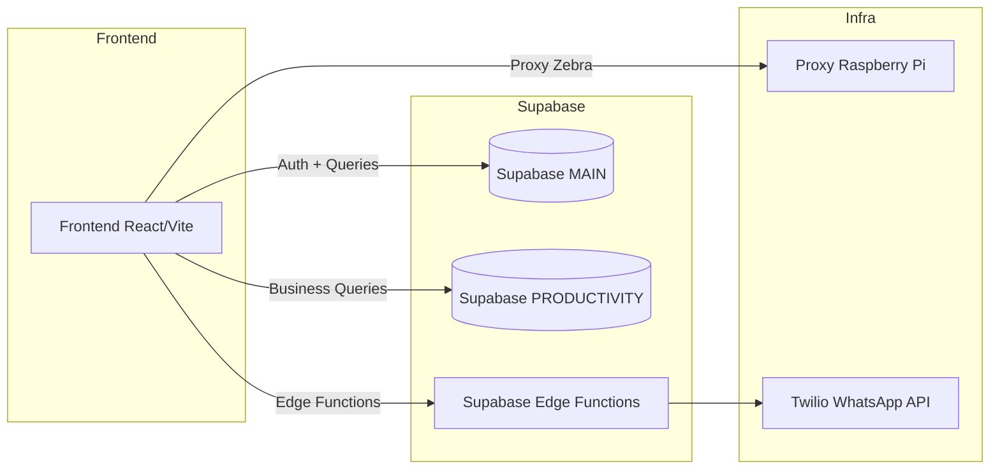
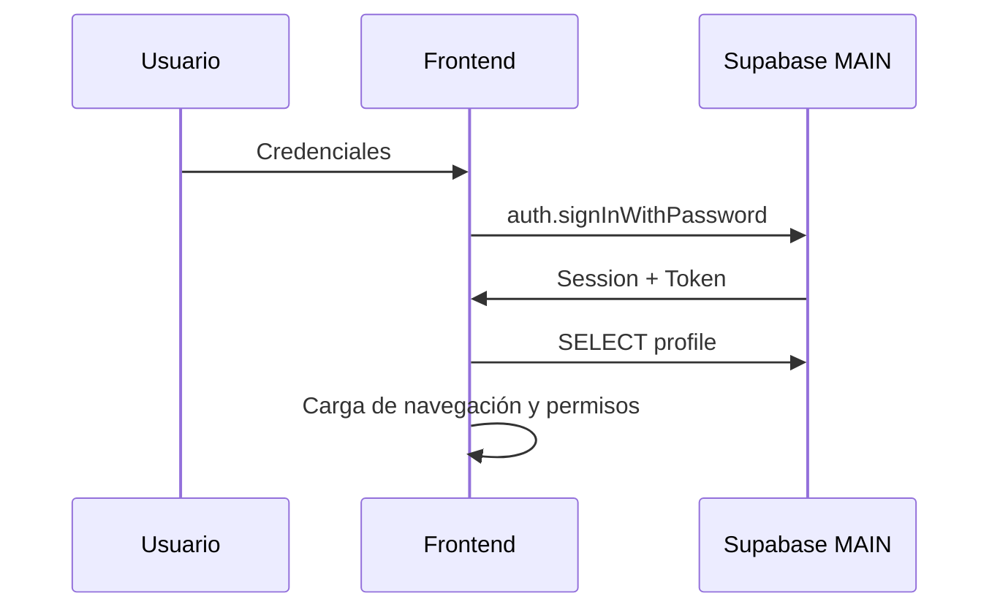
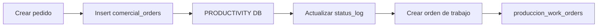
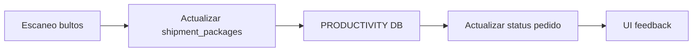

# ARQUITECTURA_SISTEMA

Fecha: 2026-01-28

## Diagrama de arquitectura (alto nivel)

## Capas y módulos

### 1) Frontend (React + Vite + TS)
- **Entradas**: `src/main.tsx`, `src/App.tsx`.
- **Routing**: `react-router-dom` con rutas públicas y protegidas.
- **UI**: componentes base en `src/components/ui` y dominios en `src/features/*`.
- **Estado / Datos**: React Query + hooks personalizados (`src/hooks/*`).

### 2) Integración Supabase
- **Clientes**: `src/integrations/supabase/client.ts`.
- **MAIN DB**: Auth, usuarios, permisos, instalaciones.
- **PRODUCTIVITY DB**: Comercial, Producción, Logística, Almacén.
- **Estrategia**: dos clientes con storage independiente para evitar conflictos.

### 3) Edge Functions
- **invite-user**: `supabase/functions/invite-user/index.ts`.
- **send-whatsapp-notification**: `supabase/functions/send-whatsapp-notification/index.ts`.
- **Uso**: invocadas desde hooks/acciones en frontend.

### 4) Infra auxiliar
- **Proxy Zebra**: `tools/raspberry-pi/*` para imprimir vía HTTP desde frontend HTTPS.

## Patrones de diseño utilizados
- **Component composition**: UI compuesto por `PageShell`, `Layout`, `Sidebar`, etc.
- **Feature modules**: separación por dominio (`features/commercial`, `features/production`, `features/logistics`, `features/installations`).
- **Hooks as data layer**: CRUD y queries encapsulados (`use-orders`, `use-work-orders`, `use-supabase`, etc.).
- **Service layer**: `orderService.ts`, `workOrderService.ts` para lógica de negocio.

## Inventario de capas y responsabilidades

### Presentación
- `src/pages/*`: páginas con rutas.
- `src/components/*`: UI reusable y layouts.
- `src/features/*/components`: UI específica por dominio.

### Lógica de negocio
- `src/features/*/services/*`: reglas de negocio y orquestación.
- `src/hooks/*`: queries y mutaciones.

### Integración de datos
- `src/integrations/supabase/*`: clientes y tipos.
- `supabase/functions/*`: edge functions.

## Inventario detallado de componentes (referencia)
Para el inventario por archivo (propósito, exports y dependencias), ver:
- `docs/audits/2026-01-28/FILE_SUMMARIES.md`

## Puntos de integración
- Supabase MAIN: Auth, perfiles, instalaciones.
- Supabase PRODUCTIVITY: comercial, producción, logística, almacén.
- Twilio WhatsApp: `send-whatsapp-notification` (edge function).
- Proxy Zebra (Raspberry Pi): impresión de etiquetas.

## Flujos de datos principales

### Flujo 1: Login y perfil

### Flujo 2: Comercial -> Producción

### Flujo 3: Logística (envíos)

## Integraciones externas
- **Twilio WhatsApp**: vía Edge Function `send-whatsapp-notification`.
- **Mapas**: generación de URLs en `src/utils/maps.ts`.
- **QR**: `html5-qrcode`, `qrcode`, `qrcode.react`.
- **PDF/Docs**: `jspdf`, render HTML para etiquetas y documentos.

## Tecnologías y versiones relevantes
- React 18.3.1
- Vite 7.1.9
- TypeScript 5.8.3
- TailwindCSS 3.4.17
- Supabase JS 2.58.0
- TanStack Query 5.83.0
- Radix UI (varios paquetes)

## Riesgos arquitectónicos
- Lógica de negocio acoplada a componentes UI grandes.
- Tipado incompleto en dominios (uso de `any`).
- Políticas RLS no versionadas en repo.

## Referencias
- `docs/architecture/ARCHITECTURE.md`
- `docs/TESTING_PLAN.md`
- `docs/audits/2026-01-27/*.md`
